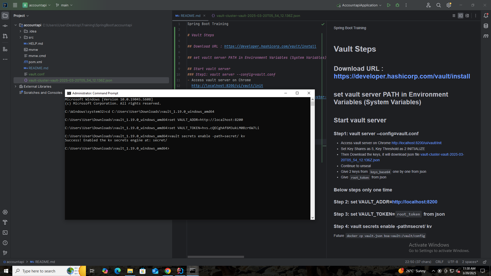

Spring Boot Training

# Vault Steps

## Download URL : https://developer.hashicorp.com/vault/install

## set vault server PATH in Environment Variables (System Variables)

## Start vault server
### Step1: vault server --config=vault.conf
- Access vault server on Chrome 
  http://localhost:8200/ui/vault/init
- Set Key Shares as 5, Key Threshold as 2 INITIALIZE
- Then Download the keys, it will download json file [vault-cluster-vault-2025-03-20T05_54_12.136Z.json](vault-cluster-vault-2025-03-20T05_54_12.136Z.json)
- Continue to unseal
- Give 2 keys from `keys_base64` one by one from json
- Give `root_token` from json

### Below steps (2,3,4) only one time
### Step 2: set VAULT_ADDR=http://localhost:8200
### Step 3: set VAULT_TOKEN=`root_token` from json
### Step 4: vault secrets enable -path=secret/ kv



### Reload vault server UI `http://localhost:8200/ui/vault/dashboard` and pass `root_token` again.

### Create secrete from Secret Engines
Path -> mysqlsecret
Username -> root
Password -> `MYSQL DB password`

#

# Future
```docker cp vault.json boa-vault:/vault/config```